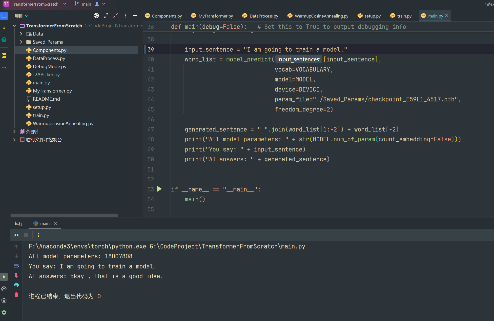

# Introduction

This is my personal project during the 2025 summer break.

This project uses PyTorch to implement an encoder-decoder Transformer from scratch (almost). 

The following components are manually implemented:
- Word embedding layer
- Learnable positional encoding layer
- Multihead Self/Cross-Attention layer
- Attention masks
- Encoder
- Decoder
- Layer normalization
- Cosine annealing with warmup

Currently, the model is trained on 2406 pairs of dialog text, to see the model's result quickly. Therefore, the performance is not quite good temporarily.
The following plan is to switch to a larger and better dataset and re-train the model.
In addition, the current tokenizer comes from the library nltk, and the vocabulary is collected from the Brown corpus. A new WordPiece tokenizer's implementation is on the development schedule.

## Current Artificial Idiot Performance

